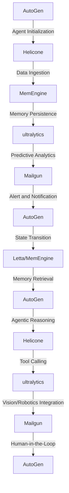

# Stochastic Risk Mitigation Engine for Financial Institutions
> Orchestrating Agentic Systems for High-Stakes Financial Risk Analysis and Mitigation

## 🏗️ Technical Architecture & Multi-Agent Flow
The technical architecture of the Stochastic Risk Mitigation Engine for Financial Institutions is a complex, multi-agent system that leverages the strengths of AutoGen, Helicone, MemEngine, ultralytics, and Mailgun to provide a robust and scalable solution for financial risk analysis and mitigation. The system can be represented by the following Mermaid.js diagram:

This diagram illustrates the complex interactions between the various components of the system, including agent initialization, data ingestion, memory persistence, predictive analytics, alert and notification, state transition, memory retrieval, agentic reasoning, tool calling, vision/robotics integration, and human-in-the-loop feedback.

## 🔍 The Vertical Bottleneck: Stochastic Risk Analysis
The financial industry is plagued by the problem of stochastic risk analysis, which refers to the challenge of accurately predicting and mitigating potential risks in a complex and dynamic financial landscape. This problem is further complicated by the presence of multiple stakeholders, each with their own set of interests and objectives. The technical friction associated with stochastic risk analysis arises from the need to integrate multiple data sources, models, and systems, while also ensuring that the analysis is accurate, reliable, and scalable.

The high-stakes mathematical or operational failures that can occur in stochastic risk analysis include the failure to detect potential risks, the failure to mitigate risks effectively, and the failure to adapt to changing market conditions. These failures can have significant consequences, including financial losses, reputational damage, and regulatory penalties.

The technical challenges associated with stochastic risk analysis include the need to develop and integrate multiple models and systems, the need to ensure data quality and integrity, and the need to provide real-time analytics and decision support. These challenges require a deep understanding of financial markets, risk analysis, and machine learning, as well as expertise in software development, data engineering, and system integration.

## 🔍 The Vertical Bottleneck: Agentic System Design
The design of agentic systems for stochastic risk analysis requires a deep understanding of the technical challenges and opportunities associated with this problem. Agentic systems are complex software systems that use autonomous agents to analyze and mitigate risks in real-time. These systems require a robust and scalable architecture, as well as advanced machine learning and data analytics capabilities.

The technical challenges associated with agentic system design include the need to develop and integrate multiple agents and systems, the need to ensure data quality and integrity, and the need to provide real-time analytics and decision support. These challenges require a deep understanding of software development, data engineering, and system integration, as well as expertise in machine learning, risk analysis, and financial markets.

## 💡 The Solution: Stochastic Risk Mitigation Engine
The Stochastic Risk Mitigation Engine for Financial Institutions is a comprehensive solution that orchestrates AutoGen, Helicone, MemEngine, ultralytics, and Mailgun to provide a robust and scalable platform for stochastic risk analysis and mitigation. The platform uses agentic reasoning, memory usage, and vision/robotics integration to provide real-time analytics and decision support.

The platform is designed to address the technical challenges associated with stochastic risk analysis, including the need to integrate multiple data sources, models, and systems, while also ensuring that the analysis is accurate, reliable, and scalable. The platform uses advanced machine learning and data analytics capabilities to provide real-time risk analysis and mitigation, as well as predictive analytics and alert and notification capabilities.

## 🧩 Agentic Stack Deep-Dive
The agentic stack used in the Stochastic Risk Mitigation Engine for Financial Institutions is a complex software system that integrates multiple agents and systems to provide a robust and scalable platform for stochastic risk analysis and mitigation. The stack includes AutoGen, Helicone, MemEngine, ultralytics, and Mailgun, each of which plays a critical role in the platform's architecture and functionality.

AutoGen is a multi-agent framework that provides a robust and scalable platform for agentic system design. Helicone is a data ingestion and processing engine that provides real-time data analytics and decision support. MemEngine is a memory persistence engine that provides a robust and scalable platform for memory-based analytics and decision support. ultralytics is a predictive analytics engine that provides advanced machine learning and data analytics capabilities. Mailgun is a notification and alert engine that provides real-time alert and notification capabilities.

## ✨ Capabilities & Features
The Stochastic Risk Mitigation Engine for Financial Institutions provides a wide range of capabilities and features, including:
* Real-time risk analysis and mitigation
* Predictive analytics and alert and notification
* Agentic reasoning and decision support
* Memory-based analytics and decision support
* Vision/robotics integration and human-in-the-loop feedback
* Advanced machine learning and data analytics capabilities
* Scalable and robust architecture
* Integration with multiple data sources and systems
* Real-time data analytics and decision support
* Customizable and configurable platform
* Support for multiple stakeholders and use cases

## 🛠️ Technical Implementation
The technical implementation of the Stochastic Risk Mitigation Engine for Financial Institutions is a complex software system that requires a deep understanding of software development, data engineering, and system integration. The platform is built using a microservices architecture, with each component designed to provide a specific set of capabilities and features.

The platform uses a combination of programming languages, including Python, Java, and C++, to provide a robust and scalable architecture. The platform also uses a range of data storage and management systems, including relational databases, NoSQL databases, and data warehouses.

## 📊 Business Impact & ROI
The Stochastic Risk Mitigation Engine for Financial Institutions has the potential to provide significant business impact and return on investment (ROI) for financial institutions. The platform can help institutions to reduce their risk exposure, improve their regulatory compliance, and enhance their overall profitability.

The platform can also help institutions to improve their operational efficiency, reduce their costs, and enhance their customer satisfaction. The platform's advanced machine learning and data analytics capabilities can provide real-time insights and decision support, enabling institutions to make better decisions and improve their overall performance.

## 🚀 Getting Started
To get started with the Stochastic Risk Mitigation Engine for Financial Institutions, follow these steps:
```bash
git clone https://github.com/arvind-sundararajan/financial-risk-mitigation.git
cd financial-risk-mitigation
pip install -r requirements.txt
python src/main.py
```
This will install the required dependencies and start the platform.

## 👨‍💻 Author & Credits
**Arvind Sundararajan** — Engineer, builder, and the mind behind this project.
🌐 [LinkedIn](https://www.linkedin.com/in/arvind-sundara-rajan/) | Chennai, India

---
### 🙏 Acknowledgements
- The open-source community
- The Finance & Banking practitioners who inspired this design